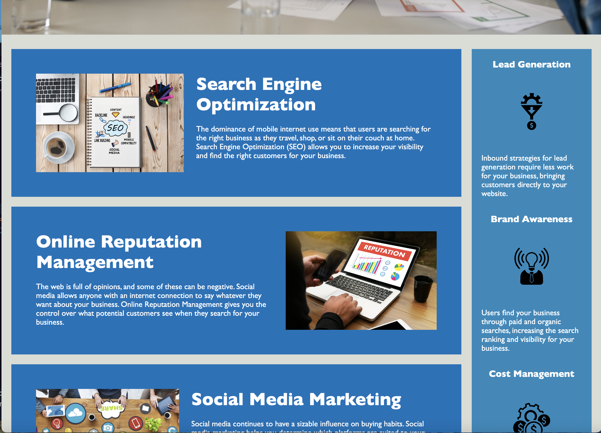

## SEO Upgrade/Modification

## Description
This is an update to a SEO Website to not affect the front-end performance/apperance of the website, but improve it within its structure.

## Installation
Extra equipment is not needed to view this project.

## Usage
I hope the updated model provides more structured and detailed code for future developers to work easier with down the line.

## Roadmap
I would check for more single-use classes and also convert them to IDs.

## Project status
Completed.

## Links
Link to deployment: https://shannyan.github.io/seo-one/
Linke to repo: https://github.com/ShannyaN/seo-one